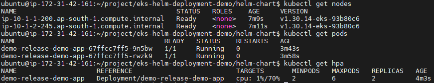
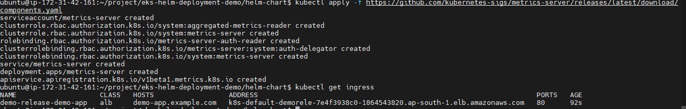
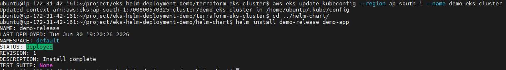
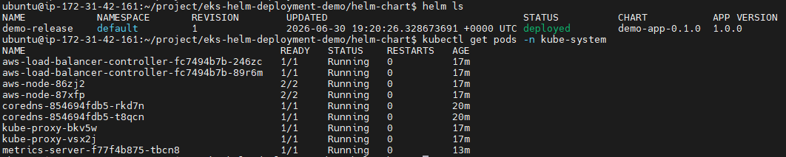
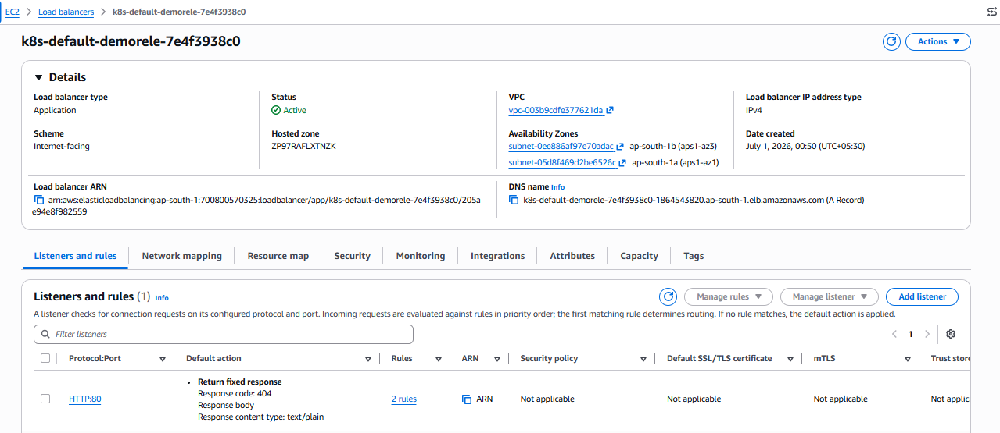
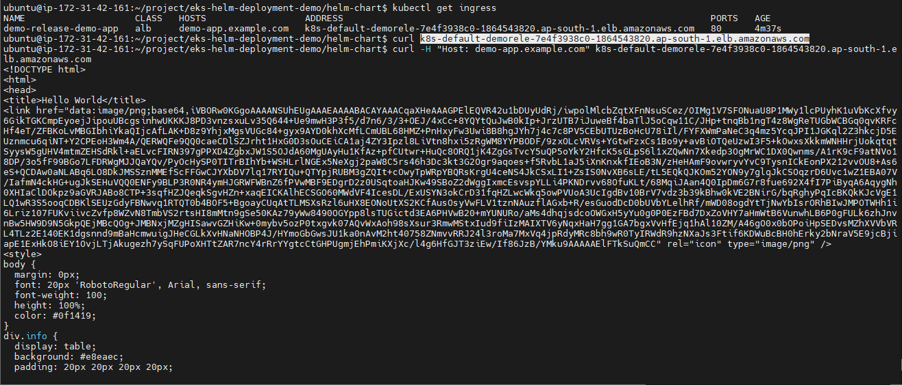
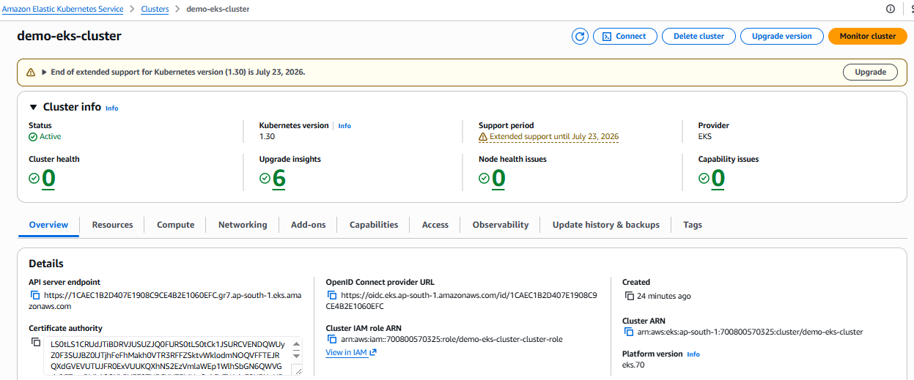
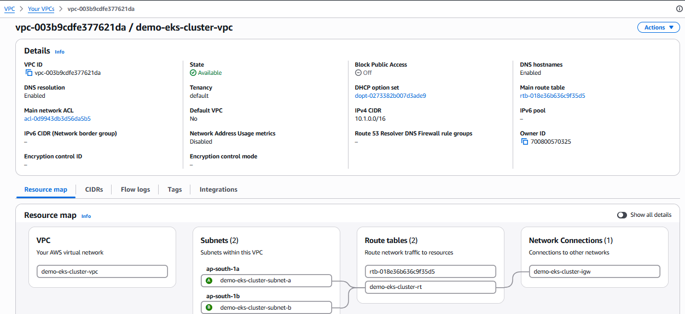
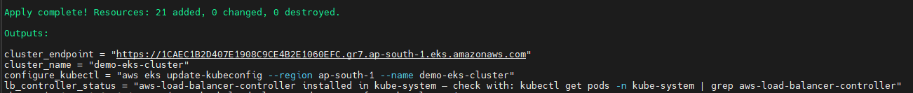

# EKS + Helm Deployment Demo

A fully automated pattern for provisioning an Amazon EKS cluster with
Terraform and deploying an application onto it via a reusable Helm chart —
the same combination used in production to manage **50+ containerized
applications** with zero-downtime rolling deployments.

## Problem

Running containers on EKS requires more than just `kubectl apply` — you
need IAM roles separated between control plane and worker nodes, an OIDC
provider for in-cluster AWS authentication (IRSA), and a Load Balancer
Controller to actually provision ALBs from Ingress objects. Setting this up
manually is not repeatable.

## Solution

Everything is automated in a single `terraform apply`:

- **EKS cluster** with managed node group across 2 AZs
- **OIDC provider** — enables IRSA (IAM Roles for Service Accounts)
- **AWS Load Balancer Controller** — installed via Terraform's Helm provider,
  authenticated via IRSA, creates real internet-facing ALBs from `Ingress` objects automatically
- **Helm chart** — parameterized Deployment, Service, Ingress (ALB), and HPA

## Architecture

```
Terraform ──▶ EKS Control Plane + Managed Node Group (2 AZs)
              │
              ├──▶ OIDC Provider
              │         └──▶ IAM Role (IRSA) ──▶ LB Controller ServiceAccount
              │
              └──▶ Helm: AWS Load Balancer Controller (kube-system)
                              │
                   Helm: demo-app
                              │
              ┌───────────────┼───────────────┐
              ▼               ▼               ▼
         Deployment        Service        Ingress (real ALB)
         (2-6 pods,       (ClusterIP)    internet-facing,
          HPA-scaled)                    auto-provisioned
```

## Tech Used

Terraform · Amazon EKS · Helm · Kubernetes · AWS IAM (IRSA/OIDC) · ALB · HPA

## Usage

```bash
# 1. Provision cluster + OIDC + IAM + LB controller — everything in one apply
cd terraform-eks-cluster
terraform init
terraform apply

# 2. Configure kubectl
aws eks update-kubeconfig --region ap-south-1 --name demo-eks-cluster

# 3. Deploy app via Helm
cd ../helm-chart
helm install demo-release ./demo-app

# 4. Wait for real ALB address
kubectl get ingress -w

# 5. Test
curl -H "Host: demo-app.example.com" http://<alb-address>
```

## Proof of Deployment

### Nodes ready and pods running


### HPA active with metrics


### Helm release installed


### LB Controller running in kube-system


### Real ALB provisioned automatically


### Ingress ALB URL tested successfully


### EKS Cluster active in console


### VPC and networking


### Terraform resources created


## Key Design Decisions

- **IRSA over static credentials**: the LB Controller uses a Kubernetes service account annotated with an IAM role ARN — no AWS access keys stored anywhere in the cluster
- **Subnet tagging** (`kubernetes.io/role/elb`): without these tags the controller cannot discover which subnets to place ALBs into
- **Managed node group** over self-managed: AWS handles patching and replacement of worker nodes, matching how this was run in production
- **`lifecycle { ignore_changes = [task_definition] }`**: Terraform manages the cluster, Helm manages the app — clean separation of concerns

## Cleanup

```bash
helm uninstall demo-release    # controller removes the ALB
sleep 30
cd ../terraform-eks-cluster && terraform destroy
```
